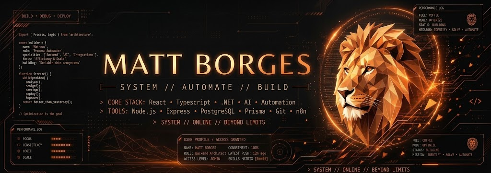

<p align="center">
  
</p>

<p align="center">
  
</p>

---

### 01 // MATT_IDENTITY

```javascript
const matt = {
  role: "IT Professional | Developer | Automation",
  ...
};

# `MATT_SYSTEM`

### `01 // MATT_IDENTITY`

```javascript
const matt = {
  role: "IT Professional | Developer | Automation",
  stack: [
    "JavaScript",
    "React",
    "Node.js",
    "Python",
    "Java",
    "SQL"
  ],
  tools: [
    "n8n",
    "Git",
    "GitHub",
    "Prisma",
    "PostgreSQL"
  ],
  focus: [
    "Web Development",
    "Backend",
    "Automation",
    "System Integration"
  ],
  building: [
    "TravelWay",
    "FleetWise"
  ],
  mindset: "Solve. Build. Automate. Evolve."
};
```

---

### `02 // MATT_STACK`

`MATT SYSTEM > ALL MODULES LOADED ✓`

#### `LANGUAGES`


#### `FRONTEND`


#### `BACKEND & DATABASE`


#### `AUTOMATION & TOOLS`


---

### `03 // MATT_TERMINAL`

```text
> booting matt system...

[ OK ] Developer profile loaded
[ OK ] IT modules loaded
[ OK ] Front-end modules loaded
[ OK ] Back-end modules loaded
[ OK ] Database modules loaded
[ OK ] Automation modules loaded

ROLE        : IT Professional / Developer
STACK       : React | Node.js | Python | Java | SQL
AUTOMATION  : n8n | APIs | Integrations
DATABASE    : PostgreSQL | Prisma
BUILDING    : TravelWay | FleetWise
FOCUS       : Software & Automation
MODE        : Building
STATUS      : ONLINE

> awaiting next challenge... █
```

---

### `04 // ABOUT_ME`

Sou profissional de **Tecnologia da Informação**, com experiência em suporte técnico, sistemas, infraestrutura e automação de processos.

Minha trajetória começou na área de suporte e resolução de problemas, evoluindo para o desenvolvimento de **sistemas, APIs e automações**.

Hoje meu foco está em unir conhecimento de T.I com desenvolvimento de software para criar soluções práticas, automatizar processos e transformar tarefas repetitivas em fluxos mais eficientes.

```text
IT SUPPORT
     ↓
PROBLEM SOLVING
     ↓
AUTOMATION
     ↓
SOFTWARE DEVELOPMENT
     ↓
SYSTEMS THAT SOLVE REAL PROBLEMS
```

---

### `05 // TRAVELWAY`

## ✈️ TravelWay

Plataforma web voltada para o segmento de turismo, desenvolvida com foco em **experiência do usuário, organização de destinos e apresentação de pacotes de viagem**.

```text
PROJECT TYPE : Web Application
STATUS       : COMPLETED
FOCUS        : UI / UX / React
```

**Tecnologias**

`React` `Vite` `JavaScript` `CSS` `React Router`

**Destaques**

* Interface moderna e responsiva
* Componentização com React
* Navegação entre páginas
* Organização de dados
* Apresentação de destinos
* Seção de pacotes de viagem
* Estrutura preparada para evolução futura

🔗 **Repository:**
https://github.com/matheussoldiermonster-afk/Travel

---

### `06 // FLEETWISE`

## 🚛 FleetWise

Sistema de gerenciamento de frota desenvolvido para centralizar informações de **veículos, abastecimentos, viagens e usuários**.

O projeto representa minha evolução na construção de aplicações completas, trabalhando tanto no frontend quanto no backend.

```text
PROJECT TYPE : Full Stack Application
STATUS       : ACTIVE
FOCUS        : Backend / APIs / Database
```

**Tecnologias**

`React` `Node.js` `Express` `Prisma` `PostgreSQL` `JWT`

**Destaques**

* Autenticação de usuários
* API REST
* Banco de dados relacional
* CRUD completo
* Gestão de veículos
* Gestão de abastecimentos
* Controle de viagens
* Dashboard
* Arquitetura frontend + backend

```text
FRONTEND
   ↓
REACT
   ↓
REST API
   ↓
NODE.JS / EXPRESS
   ↓
PRISMA
   ↓
POSTGRESQL
```

🔗 **Repository:**
https://github.com/matheussoldiermonster-afk/FleetWise

---

### `07 // DEVELOPMENT_MINDSET`

```text
> how I build

01  Understand the problem
02  Design the solution
03  Build the system
04  Test the result
05  Automate what can be automated
06  Improve continuously
```

Não busco apenas fazer algo funcionar.

Busco entender **por que o problema existe**, construir uma solução eficiente e encontrar formas de tornar o processo cada vez melhor.

---

### `08 // CURRENTLY`

```text
[+] Developing web applications
[+] Building full-stack projects
[+] Creating automation workflows
[+] Improving backend development
[+] Studying software architecture
[+] Exploring AI & cybersecurity
[+] Building portfolio projects
```

---

### `09 // GITHUB_METRICS`

<p align="center">
  

  
</p>

---

### `10 // CONTRIBUTION_MATRIX`

<p align="center">


</p>

`CONTRIBUTION MATRIX > BUILDING MODE ✓`

---

### `11 // CONNECT`

<p align="center">

<a href="https://github.com/matheussoldiermonster-afk">

</a>

<a href="[https://www.linkedin.com/](https://www.linkedin.com/in/matheus-borges-a27b26225/)">

</a>

</p>

```text
> connection status: OPEN ✓

MATT_SYSTEM
IT • SOFTWARE • AUTOMATION

"Build solutions. Automate processes. Keep evolving."

> system shutdown? [ NO ]
```

<p align="center">
  <sub>Thanks for visiting the MATT_SYSTEM.</sub>
</p>
